<!-- 
╔══════════════════════════════════════════════════════════════════════════════╗
║                                                                              ║
║   K A N C H I   S A W   —   S Y S T E M   P R O F I L E                     ║
║                                                                              ║
║   Full-Stack Developer • Web3 Builder • Systems Programmer                  ║
║                                                                              ║
╚══════════════════════════════════════════════════════════════════════════════╝
-->

  

  

  

 

  

 

<h2 align="center">
  
</h2>

  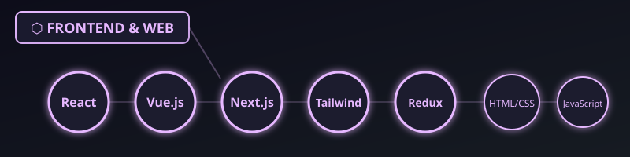

  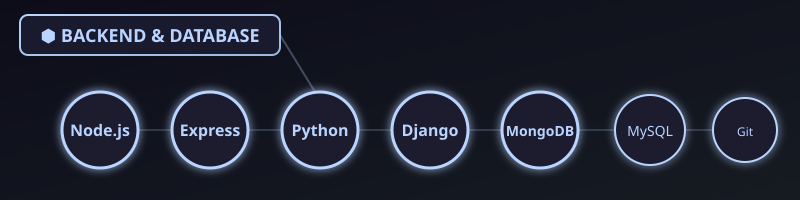

  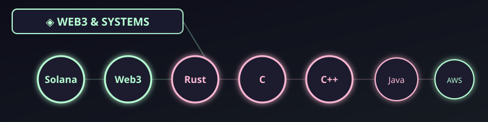

  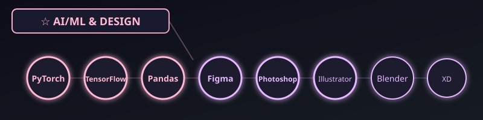

 

<h2 align="center">
  
</h2>

  

  

  

 

<h2 align="center">
  
</h2>

  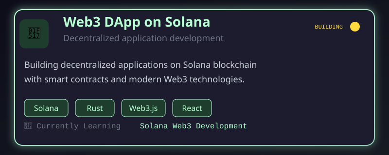

  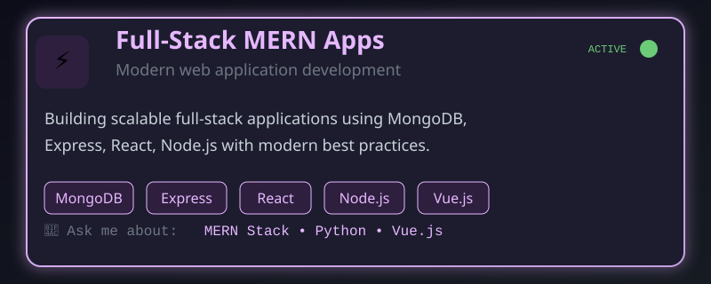

  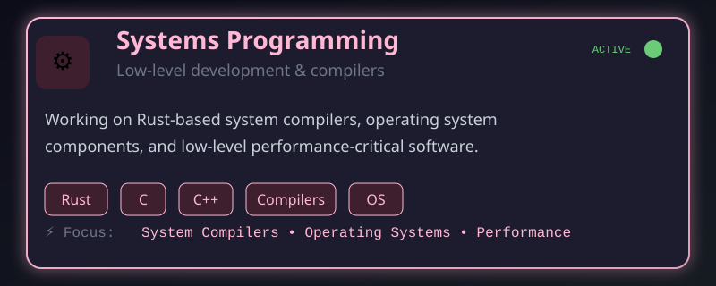

 

  

 

<h2 align="center">
  
</h2>

  

  
  &nbsp;
  
  &nbsp;
  

 

  

  

